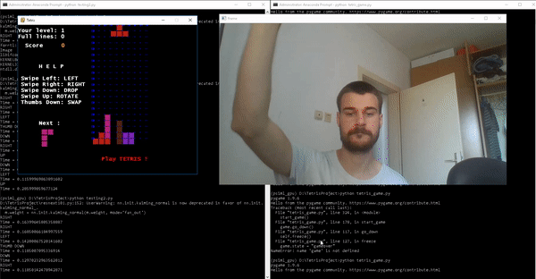

# TetrisGestureRecognition

PSIML6 project by Tamara Lazarević and Veljko Maksimović.



Hand hestures recognized from webcam video stream used to control a game of Tetris.
- detector - transfer learning on lightweight model trained on Kinetics dataset
- classifier - heavyweight pretrained model
- Tetris game - made in Python to resemble DOS tetris

-to be fully finished...

``` 
@article{kopuklu_real-time_2019,
	title = {Real-time Hand Gesture Detection and Classification Using Convolutional Neural Networks},
	url = {http://arxiv.org/abs/1901.10323},
	author = {Köpüklü, Okan and Gunduz, Ahmet and Kose, Neslihan and Rigoll, Gerhard},
  year={2019}
}

@article{kopuklu2020online,
  title={Online Dynamic Hand Gesture Recognition Including Efficiency Analysis},
  author={K{\"o}p{\"u}kl{\"u}, Okan and Gunduz, Ahmet and Kose, Neslihan and Rigoll, Gerhard},
  journal={IEEE Transactions on Biometrics, Behavior, and Identity Science},
  volume={2},
  number={2},
  pages={85--97},
  year={2020},
  publisher={IEEE}
}
```
